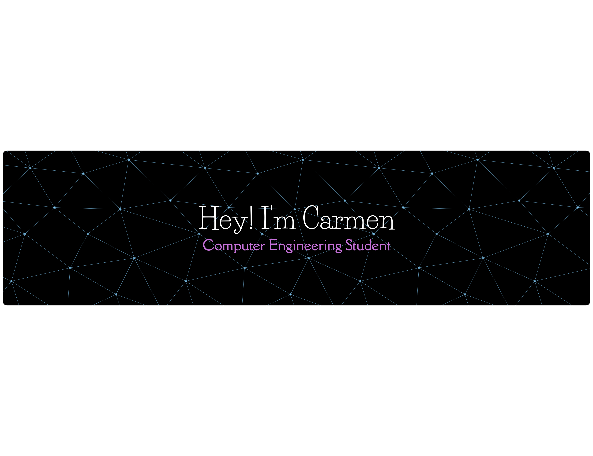

## Hi! I'm Carmen

## About Me 🚀

I'm a passionate **Computer Engineering Student** with experience in **website development**. I love tackling complex problems, learning new skills, and collaborating with diverse teams to create innovative solutions.

- 🌱 Currently learning: **CSS and JavaScript**
- 🔭 Working on: **Developing a website solo and non-profit**
- 🌍 Languages: **HTML, C++, Python, Java, JS, CSS, NASM, Spanish, English, Catalan, French**

## My Skills 🧠

 
 

<!--
## Featured Projects 💻

### [Lawyer Website](project_1_link)

**[Project 1 Title]** is a **[brief project description]** built with **[technologies used]**. This project demonstrates my ability to **[skills demonstrated by the project]**. You can check out the repository [here](project_1_repository_link).

## Get in Touch 

- **[Personal Website / Blog]**(your_website_or_blog_link)
- **[LinkedIn]**(your_linkedin_profile_link)
- **[Twitter]**(your_twitter_profile_link)
-->

